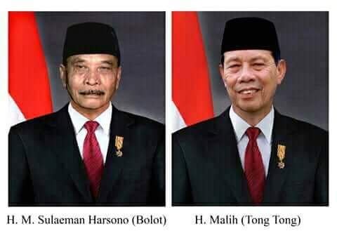
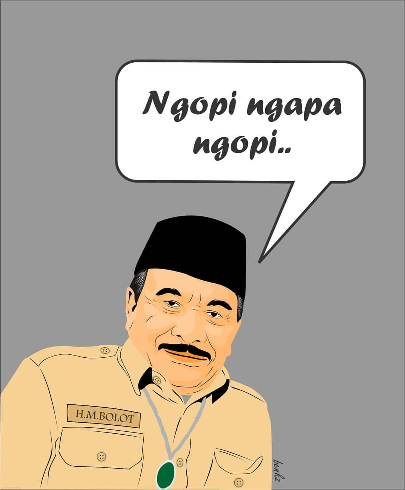

import FakeRc from '../../components/FakeRc'

## `Validasi CakNun Tentang Keadilan`

"_`For GOD's Sake`_, hanya ada dua kemungkinan; berlaku adil atau zhalim, mencintai kejujuran atau membencinya. Kita sudah pantau gelagat [Ini Budi](). Boleh jadi masih tersisa beberapa keturunan [Suku Madyan](https://en.wikipedia.org/wiki/Midian) yang gemar mengurangi serta menambahi takaran timbangan _asal perut kenyang_. Namun itu soal lain. Soal utamanya adalah tentang `Validasi Keadilan` yang terletak dalam etika demokrasi bangsa ini dimana seluruh rakyat telah memilih kalian berdua -- [H. Bolot](https://id.wikipedia.org/wiki/Bolot) dan [H. Malih](https://id.wikipedia.org/wiki/Malih) yang telah tertulis jauh sebelum telapak kaki Adam menapak di atas bumi di dalam Kitab Lauh Mahfuz dalam satu bab berjudul `Presidential Treshold Conspiracy`."

> Bukan hal sulit mengajak para manusia yang tertindas untuk menjunjung tinggi nilai sebuah keadilan. Namun maqam tersulit justru jika manusia tetap berlaku adil meskipun hal itu tidak menguntungkan posisinya.
> Dan itulah Validasi Keadilan !


"Jangan mempercundangi `angka`. Telah dikabarkan bahwasanya Tuhan menciptakan semesta ini selama `ENAM` hari, maka boleh jadi `angka` merupakan makhluk pertama yang diciptakan jauh sebelum Dia ciptakan semesta."

Demikian wejangan [CakNun](https://www.caknun.com/) seorang `Negarawan Sejati` -- untuk generasi di masa depan, [Maiyah](https://www.caknun.com/link/) dan `Generasi Bangsa yang Tersandera`.

---

## `This Article is WIP`

`Fake Real Count App` adalah aplikasi `real count` untuk menampung data rakyat dalam memilih kandidat presiden antara [H. Bolot](https://id.wikipedia.org/wiki/Bolot) `versus` [H. Malih](https://id.wikipedia.org/wiki/Malih). Tujuan pembuatan aplikasi ini sebagai model edukasi untuk menjelaskan fungsi `Logika Perkondisian` dalam upaya meminimalisir kesalahan input `(human-error)` pada saat user melakukan proses `entry-data`.

## `Conditional Statement In Validation Process`

Proses perkondisian yang akan kita kupas di artikel ini, dalam bahasa teknis dinamakan `Proses Validasi`. Sejauh ini proses validasi pada `Fake Real Count App` membantu para petugas `entry-data`-- siapapun itu, tidak terkecuali puteri saya yang masih kelas 1 SD _pun_ -- dimana mereka `TIDAK DAPAT MEMASUKKAN DATA` apabila:

- _kedua suara paslon_ serta _Suara Sah_ bernilai _Nol [0]_ atau tidak di isi.
- data yang dimasukkan bukan berupa nilai _numeric_ atau berupa selain _angka_.
- data nilai _numeric_ yang dimasukkan bernilai _minus_ atau _kurang dari nol_.
- nilai suara kedua _paslon_ yang dijumlahkan _TIDAK SAMA_ dengan nilai _Suara Sah_ yang di input.
- Merujuk Keputusan `KPU` bahwa maksimal suara adalah [300 per `TPS`](https://news.detik.com/berita/d-4377715/kpu-satu-tps-paling-banyak-300-pemilih), maka sistem memastikan `Total Keseluruhan Suara` yang melebihi angka 300 suara _TIDAK AKAN_ pernah sampai ke server sampai hari kiamat.
- Para petugas atau pelaku _entry-data_ diberikan pesan peringatan berbeda tergantung kondisi proses validasi yang tidak terpenuhi oleh sistem.

Sila test `Fake Real Count App` di bawah ini dan masukkan beberapa kemungkinan input data yang salah seperti yang telah dijelaskan di atas _dan atau_ masukkan input yang benar untuk melihat berbagai respons pada aplikasi ini. Setelah itu kita akan kupas satu persatu tentang logika perkondisian serta bagaimana penulisannya menggunakan bahasa pemograman `JavaScript`.

---

## `Fake Real Count App`



<div className="Image__Medium">
<FakeRc />
</div>

---

## `Booleans`

Sebelum membahas logika, baiknya dijelaskan `basic syntax` yang diperlukan dalam logika perkondisian.

Hanya ada dua nilai yang dimiliki oleh tipe data `Boolean`: nilai `true` dan `false`.

```javascript
let b = true
console.log(typeof b) // output: 'boolean'

let b = false
console.log(typeof b) // output: 'boolean'
```

Jika kita tulis `true` atau `false` dengan `"true"` dan `"false"`, maka tipe data berubah menjadi string.

```js
let b = 'false'
console.log(typeof b) // output: 'string'
```

### `Logical Operators`

Ada tiga operator, biasa disebut `logical operators`. Ketiganya adalah:

- ! -logical NOT (negation)
- && - logical AND
- || - logical OR

#### `Negation`

Mirip-mirip kaum salaf 🙃, _jika sesuatu itu tidak benar, maka pastilah itu salah_. Negasi diwakilkan dengan tanda `!` dimana sangat mudah memahami fungsinya tanpa perlu penjelasan dengan membaca `code` berikut:

```js
let b = !true
console.log(b) // output: false
```

Tetapi kalo kita tuliskan tanda negasi dua kali, maka nilai kembali ke keadaan semula.

```js
let b = !!true
console.log(b) // output: true
```

```js
let b = !!false
console.log(b) // output: false
```

#### `Logical AND (&&) -- Logical OR (||)`

Ketika menggunakan `&&`, hasilnya akan selalu `true` jika _kedua_ `operand` bernilai `true`. Sedangkan ketika menggunakan `||`, hasilnya akan selalu `true` jika _salah satu_ `operand` bernilai `true`.

<div className="Image__Small">

|    Operation     | Result |
| :--------------: | :----: |
| true `&&` true   | true   |
| true `&&` false  | false  |
| false `&&` true  | false  |
| false `&&` false | false  |
| true \|\| true   | true   |
| true \|\| false  | true   |
| false \|\| true  | true   |
| false \|\| false | false  |

</div>


_Exactly, welcome back to the basic of algebra_...

```js {7-8,10-11}
true && true && false && true;
// false

false || true || false;
// true

false && false || true && true;
// true

false && (false || true) && true;
// false

// do you have an idea...
// ...why is the latest result returns to 'false' ? 🔴
```
**hint:** [PEMDAS](https://www.mathsisfun.com/operation-order-pemdas.html)

**precedence:** Tanda kurung `()` didahulukan sebelum tanda negasi `!` lalu kemudian tanda AND `&&` dan terakhir adalah tanda OR `||`.

### `Comparison`

Laiknya matematika murni, `comparison operators` seperti `=, <, <=, >, >=` sering digunakan di dalam dunia programming. Namun ada perbedaan sedikit seperti simbol `=` ditulis dengan `==` dalam kebanyakan bahasa pemograman. Sedangkan `JavaScript` memiliki tanda `==` dan juga `===` dengan fungsi yang sedikit berbeda.

```js {2}
1 == 1 // true
1 == '1' // ✅ true
```

👆 Kedua `operand` di konversi menjadi tipe yang sama sebelum di komparasi, biasa disebut `loose comparison`.

```js {2}
1 === 1  // true
1 === '1'  // 🔴 false
```
👆 Kedua `operand` menghasilkan `true` jika nilainya sama / `equal` dan dengan tipe yang juga sama.

Hanya sedikit itu saja perbedaannya dan selebihnya sama dengan matematika standar. Detail dapat di baca [disini](https://www.w3schools.com/js/js_comparisons.asp).

> Hanya **`NaN`** (Not a Number) satu-satunya makhluk yang hasilnya tidak akan pernah sama -- dan akan selalu salah -- jika dikomparasikan dengan makhluk lain, bahkan dengan dirinya sendiri ! 🥺 sounds familiar...

```javascript
NaN == NaN  // 🔴 false

```

## `Jika... Maka...`

> "Jika _hari hujan_, maka saya akan _membawa payung_."

`Statement` 👆 dapat dinyatakan; "Jika suatu _kondisi_ terpenuhi, maka suatu _eksekusi_ direalisasikan."

```terminal
jika (kondisi) {
  maka (eksekusi)
}
```

Pada contoh, dalam `JavaScript` dituliskan:

```js
if (hujan) {
  return alert("Bawa payung!")
}
```

_Gimana kalo ga jadi ujan?_
Jika kondisinya tidak terpenuhi, maka eksekusi 👆 tidak terjadi. Atau kita dapat menulis satu `statement` lagi jika kondisi di atas tidak terpenuhi:

```js
if (hujan) {
  return alert("bawa payung!")
} else {
  return alert("bawa gayung!") // yup, gayung. not a typo.
}
```

## `if`, `else if`, `else`

Tapi bagaimana dengan kondisi kompleks atau berjenjang, seperti...

> "Jika dia mau diajak nonton bareng nanti malam, maka saya akan nyatakan cinta.
Jika dia menerima cinta saya, maka besok pagi saya langsung melamar.
Tapi jika dia tolak cinta saya, saat itu juga saya akan lompat dari `Fly-Over` Ciputat"

Kita dapat menuliskan...

```js
if (nonton) {
  return pesanTiketBioskop
}
  if (nembakDiterima) {
    return alert("Besok pagi melamar")
  } else if (nembakDitolak) {
    return lompatDariFlyOverCiputat
  } else {
    return kuserahkanPadaNYA
  }
```

Kira-kira gitu konsepnya...

## `How To Validate FAKE Real Count App ?`

Validasi bukanlah hal yang asing karena sering kita temui dalam kehidupan sehari-hari. Kita tidak dapat mentransfer uang via ATM jika nomor rekening tidak sesuai atau jumlah nomornya kurang atau jumlah nominal transfer kurang dari batas minimal yang diizinkan. Kita tidak dapat memasukkan angka `CVV` pada kartu kredit jika angkanya _kurang dari atau lebih dari_ tiga. Kita tidak dapat melihat foto instagram akun yang di `setting private`, kecuali akun tersebut `folback` akun kita.

Salah satu tugas utama seorang `programmer` adalah membuat `validasi system`, baik di sisi `front-end (user/client)` maupun di sisi `back-end (database/server)`. Bahkan `smartphone` istri Anda pun boleh jadi memiliki sistem validasi berjenjang dengan memfungsikan fitur `lockscreen passcode (PIN, Pattern, fingerprint, face-unlock)` untuk menghalangi `hasrat-kepo` Anda.

Sungguh hal yang aneh -- jika tidak boleh mengatakan `nonsense`, manakala [Sistem KPU](https://pemilu2019.kpu.go.id/#/ppwp/hitung-suara/) tidak ada validasi standar seperti `batas maksimum suara per TPS tidak boleh melebihi 300 suara` dan yang lebih aneh lagi, ketiadaan `basic` validasi `jika suara kedua paslon yang dijumlahkan TIDAK SAMA dengan input jumlah angka Suara Sah`.

> Kesalahan input yang terjadi bukan diantisipasi, tetapi diantisipasi untuk terjadi. Karena para profesional IT manapun akan menyatakan bahwa ketiadaan validasi standar semacam itu apalagi di sebuah lembaga tinggi suatu negara dapat di duga kuat merupakan ketersengajaan -- alih-alih ketidakmampuan.

---

Kita tidak ingin `user` atau para petugas `entri-data` menginput:

#### `Tahap Pertama`
- Selain angka / `numeric`
- Angka lebih kecil dari bilangan NOL

#### `Tahap Kedua`
- Suara masing-masing paslon yang dijumlahkan tidak sama dengan jumlah Suara Sah
- Total Keseluruhan Suara per TPS lebih dari 300 suara

`Tahap Pertama` kita dapat menggunakan tipe data `NaN` atau `Not a Number` serta fungsi beberapa `comparison operator` seperti `===` atau `equal`, `!` atau `negation`, `>` atau `greater than` dan `<` atau `less than`.


```js
if (data === NaN) {
  return Error()
} else if ( data < 0 ){
  return Error()
} else {
  return VALIDATE
}
```

`Tahap Kedua` kita dapat melakukan logika perkondisian sederhana seperti:

```js
if ((suaraMalih + suaraBolot) !== suaraSah) {
  return Error()
} else if ((suaraMalih + suaraBolot + suaraTidakSah) > 300) {
  return Error()
} else {
  return VALIDATE
}
```

```terminal
🔴 hint:
✅ suara sah = suara paslon 01 + suara paslon 02;
✅ total keseluruhan suara = suara sah + suara tidak sah; atau...
✅ total keseluruhan suara = suara paslon 01 + suara paslon 02 + suara tidak sah;
```

Ada beberapa cara lain dalam menuliskan perkondisian seperti `switch-case` dan `ternary-operator`, `Insha Allah` akan dikupas pada artikel selanjutnya.

Logika Perkondisian `FAKE Real Count App` adalah model simulasi validasi dari sisi `front-end` Meski sangat sederhana dan _masih berantakan which means blom_ di `refactor`, `but it's working!`.

Sila tes input data di `FAKE Real Count App` dengan berbagai kemungkinan dan kabari jika ditemukan `bugs`. Untuk melihat `source-code` aplikasi ini sila klik 👉 [my github](https://github.com/alfieqashwa/fake-real-count).

##### `Prefer Browser: Mozilla, Chrome, Safari, Mobile-friendly & No need authentication`
---

## `Fake Real Count App`


<div className="Image__Medium">
<FakeRc />
</div>



☕ ☕ ☕ ☕ ☕
