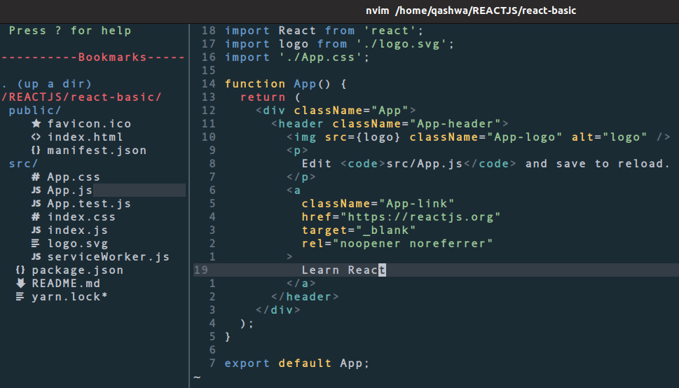

<div className="Image__Medium">
  
</div>

Cara paling umum dalam men-setup `React` adalah menggunakan `create-react-app`. Untuk mengikuti langkah-langkah yang akan kita uraikan bersama, pastikan komputer Anda terinstall `node.js` dan `npm`. Klik [Link ini](https://nodejs.org/en/download/) untuk download dan instal sesuai `OS` pada komputer Anda (eg: `Linux`, `Mac`, `Windows`).

Para developer `Facebook` menciptakan `Create React App`, sebuah `environment` yang kita butuhkan dalam membuat React App.
Di dalam `pre-configured`-nya terdapat `live development server`, `Webpack` yang berfungsi untuk meng-`compile` `React`, `JSX`, dan `ES6`, auto-prefix `CSS` files, dan `ESLint` sebagai testing yang akan memberikan peringatan manakala kita salah menulis kode.

Langkah awal adalah dengan menuliskan perintah pada `command-line-interface` atau `cli` berikut ini:

```terminal
  npx create-react-app react-basic
  cd react-basic
  npm start
```

> react-basic hanyalah nama folder, nama disesuaikan tema project...

secara otomatis browser default pada komputer Anda akan membuka http://localhost:3000 yang menampilkan halaman seperti ini:

<div className="Image__Small">
  
</div>

## `React Environment`

<div className="Image__Medium">
  
</div>

Buka `public/index.html` dan perhatikan terdapat `root id` di dalam `div tag` seperti yang pernah kita buat pada [artikel sebelumnya](https://www.alfieqashwa.me/react-in-one-file).
Kemudian buka `src/index.js`, kita urai sama-sama baris kode di dalamnya.

```jsx {5,8}
// src/index.js
import React from 'react';
import ReactDOM from 'react-dom';
import './index.css';
import App from './App';
import * as serviceWorker from './serviceWorker';

ReactDOM.render(<App />, document.getElementById('root'));

// If you want your app to work offline and load faster, you can change
// unregister() to register() below. Note this comes with some pitfalls.
// Learn more about service workers: https://bit.ly/CRA-PWA
serviceWorker.unregister();
```

kita meng-`import` dari `src/App.js`
Pada baris terakhir yang di-`highlight`, React me-render seluruh kode yang terdapat di dalam `src/App.js` yang telah di import ke dalam `src/index.js` untuk di kirim ke `id root` dalam `div tag` yang terdapat pada `public/index.html`.

Sederhananya, fokus utamanya adalah kode yang terdapat pada `src/App.js`. Mari kita buka file tersebut dan coba ubah di baris yang di `highlight` berikut menjadi:

```jsx {19}
import React from 'react';
import logo from './logo.svg';
import './App.css';

function App() {
  return (
    <div className="App">
      <header className="App-header">
        
        <p>
          Edit <code>src/App.js</code> and save to reload.
        </p>
        <a
          className="App-link"
          href="https://reactjs.org"
          target="_blank"
          rel="noopener noreferrer"
        >
          Somewhere I'm NOT Scatterbrain.
        </a>
      </header>
    </div>
  );
}

export default App;
```

## `What is JSX`

Kode di atas sepintas mirip `HTML`, tetapi sebenarnya adalah `JSX`.
`JSX` sangat powerful, mencampur `HTML` dan `JavaScript`, meskipun pada awalnya membingungkan karena kita terbiasa memisahkan kedua bahasa tersebut.
Untuk memudahkan pemahaman tentang `JSX`, kita coba tuliskan basic `HTML` di dalam `JSX`.

```jsx
import React from 'react';

function App() {
  return (
    <div className="App">
      <h2>Cello Loves React!</h2>
    </div>
  );
}

export default App;
```

Dan kini sisipkan simple `JavaScript` di dalamnya:


```jsx {4,7}
import React from 'react';

function App() {
  let celloLR = "Cello Loves React";
  return (
    <div className="App">
      <h2>{celloLR}</h2>
    </div>
  );
}

export default App;
```

## `className`

`className` fungsinya sama dengan `class` pada `HTML` dalam hubungannya dengan `CSS`, hanya saja dalam `JSX` penulisannya dalam format `camelCase`.
Lebih lanjut akan kita kupas secara khusus tentang `style` di dalam dunia `React`; dari css tradisional dan juga `css in js` seperti `styled-component` dan `emotion`, _Insyaa Allah_...

🐪 🐪 🐪 🐪 🐪
