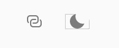
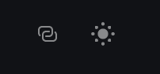

import ArticleState from '../../components/ArticleState'

# Mengenal State

`Click button` di bawah ini, atau TEKAN jika kamu mengakses blog ini melalui `mobile browser`.

<div className="Image__Small">
  <ArticleState.ToggleShowHide>
    <ArticleState.Clock />
  </ArticleState.ToggleShowHide>
</div>

Kalo kamu `ngeh`, di sudut kanan atas ada icon matahari / bulan yang jika di tekan / atau di klik maka tampilan warna pada blog ini berubah menjadi mode dark dan atau sebaliknya.

<div className="Image__Small">
  
  
</div>

Pada [Artikel sebelumnya](/props) tentang props, kita hanya membahas `dummy` component yang hanya memiliki fungsi menerima data dari `parent component`. Sifatnya dapat dikatakan `read-only`, tidak berinteraksi dengan user.

Sedangkan tombol / `button` di awal artikel ini berikut jam, juga `toggle light/dark mode` yang terletak di sudut kanan atas pada website ini -- atau jika menggunakan `mobile browser`, terletak di bawah gambar di awal artikel ini  -- di buat oleh component yang dapat berinteraksi dan memberikan respons dengan user -- tepatnya bereaksi.
Probably that's why it's called `React`.

Sebelum Oktober 2018, interaktif component hanya dapat di buat dengan `class`, dinamakan `stateful component`, dibedakan dengan `dummy component` yang dinamakan `stateless component`.
Namun setelah diperkenalkan `React Hooks` pada Oktober 2018 React versi 16.7(alpha), kita dapat membuat interaktif component dengan menggunakan `function`.

Hooks akan dibahas pada artikel selanjutnya, tetapi pemahaman tentang `stateful component` dengan menggunakan `class` sangat diperlukan untuk dapat memahami apa itu Hooks. Tanpa pemahaman tsb, kita tidak tahu manfaat-manfaat yang terdapat pada `React Hooks`.

`Class` telah dibahas pada [artikel yang lalu](/classes), mudah-mudahan dapat membantu memahami artikel ini yang khusus untuk membahas `Stateful Class Component`.

---

## Counter

Kita akan membuat aplikasi interaktif sederhana dimana sebuah angka secara `default` bernilai NOL yang nilainya akan bertambah atau berkurang SATU manakala user mengklik atau menekan salah satu dari dua tombol `(-)` dan `(+)`. Sedangkan tombol `Reset` yang terletak di antara kedua tombol tersebut berfungsi mengembalikan nilai angka ke nilai `default`. Tombol `Reset` tidak dapat di-klik atau ditekan -- serta warnanya berubah menjadi abu-abu -- hanya ketika angka bernilai NOL.

<div className="Image__Medium">
  <ArticleState.Counter />
</div>

Asumsi kamu membuat project dengan menggunakan `boilerplate react-create-app` yang pernah dijelaskan pada [artikel lalu](/create-react-app).

```bash
npx create-react-app react-counter

cd react-counter

npm run start

 // or use yarn; it's facebook's npm
yarn start
```

`localhost:3000` secara otomatis akan terbuka di `default browser` kamu.

Hapus semua code di file `App.js`, `rename` menjadi `Counter.js` dan kita tuliskan satu persatu baris `code` berikut penjelasannya.

```jsx
import React from 'react';

class Counter extends React.Component {
  render() {
    return (
      <div>
        <h1>Counter</h1>
        <h2>0</h2>
      </div>
    );
  }
}

export default Counter;
```

`Stateful Class Components` merupakan `extending` dari `Class React` pada `library`-nya.
Sering kita menemukan para developer menuliskan seperti ini...

```jsx {1,3}
import React, { Component } from 'react';

class Counter extends Component {
  render() {
    return (
        ...
    );
  }
}

export default Counter;
```
...biar ga `cape` jikalau dalam satu file terdapat banyak `class components`.

Fungsi `import` adalah untuk meminjam `class atau function` yang terdapat pada suatu `library` atau pada file lain yang diperlukan dalam sebuah file. Sedangkan fungsi `export` digunakan agar file ini dapat diakses oleh file lainnya. Pada contoh ini, file `index.js` memerlukan file ini.

Dalam satu file kita dapat memiliki banyak `export` tetapi hanya diperbolehkan satu `default export`.

Code di atas baru difungsikan secara `presentatif`, menuliskan kata `Counter` dan angka `0` secara `hard-coded`. Oleh sebab kita ingin angka tersebut dapat diubah secara interaktif bergantung tombol mana yang ditekan oleh `user`, maka penulisan `hard-coded` di atas kita modifikasi menjadi:

```jsx {7,13}
import React, { Component } from 'react';

class Counter extends Component {
  constructor(props) {
    super(props);

    this.state = { count: 0 };
  }
  render() {
    return (
      <div>
        <h1>Counter</h1>
        <h2>{this.state.count}</h2>
      </div>
    );
  }
}

export default Counter;
```

Jika kamu liat di browser kamu, maka secara visual tidak ada yang berbeda, hanya saja angka `0` kini memiliki potensi untuk di ubah oleh `user`.
Sekarang kita buat tiga tombol `(-)`, `Reset`, dan `(+)`.

```jsx {14-16}
import React, { Component } from 'react';

class Counter extends Component {
  constructor(props) {
    super(props);

    this.state = { count: 0 };
  }
  render() {
    return (
      <div>
        <h1>Counter</h1>
        <h2>{this.state.count}</h2>
        <button type="button">-</button>
        <button type="button">Reset</button>
        <button type="button">+</button>
      </div>
    );
  }
}

export default Counter;
```

`methods constructor` dan `super` lebih merupakan aturan dalam `JavaScript` alih-alih `React`, sebagaimana telah dibahas pada [artikel sebelumnya](/classes). Sedangkan `type="button"` -- `entahlah`, sifatnya opsional, hanya mengikuti disiplin `HTML` belaka.

Code di atas akan menghasilkan view seperti di bawah ini, namun angka `default` belum dapat diubah manakala kita tekan tombol `(-)` atau `(+)`.
Untuk dapat menjadikannya interaktif, kita memerlukan `API` bernama `setState`.

<div className="Image_Small">
  <ArticleState.CounterOnlyView />
</div>

---

## `setState`

Dalam aplikasi Counter ini, kita tugaskan `setState` untuk melakukan update manakala `user` menekan ketiga tombol yang dipresentasikan secara visual pada browser.

> "Hey `setState`! Jika `user` klik tombol `(+)`, tambahkan menjadi angka satu. Demikian sebaliknya, kurangkan satu apapun apapun nilai manakala `user` klik tombol `(-)`. Dan balikkan nilai angka ke keadaan defaultnya manakala `user` menekan tombol `Reset`."

So, let's start to increment the number...

```jsx {8-12,20}
import React, { Component } from 'react';

class Counter extends Component {
  constructor(props) {
    super(props);
    this.state = { count: 0 };
  }
  increment() {
    this.setState({
      count: this.state.count + 1
    })
  }
  render() {
    return (
      <div>
        <h1>Counter</h1>
        <h2>{this.state.count}</h2>
        <button type="button">-</button>
        <button type="button">Reset</button>
        <button type="button" onClick={this.increment}>+</button>
      </div>
    );
  }
}

export default Counter;
```

setState umumnya -- dan lebih `safety` dituliskan dalam sebuah `function`. `function` di dalam suatu `class` dinamakan `methods`; kita tidak perlu menuliskan `keyword function` di dalam `class`.

Logika `methods` yang kita beri nama `increment` pada `code` di atas adalah:
- Tambahkan satu angka pada apapun nilai counter.
- Tambahkan `methods` di dalam `onClick` pada `button` yang mewakilkan penambahan/increment sehingga eksekusi terjadi manakala `user` mengklik tombol/button tersebut.

```jsx {10-14,20}
import React, { Component } from 'react';

  ...

  increment() {
    this.setState({
      count: this.state.count + 1
    })
  }
  decrement() {
    this.setState({
      count: this.state.count - 1
    })
  }
  render() {
    return (
      <div>
        <h1>Counter</h1>
        <h2>{this.state.count}</h2>
        <button type="button" onClick={this.decrement}>-</button>
        <button type="button">Reset</button>
        <button type="button" onClick={this.increment}>+</button>
      </div>
    );
  }

  ...
```

Kemudian kita buat satu `methods` lagi bernama `decrement` seperti `methods` `increment`, dengan `statement` matimatika berbeda.

Sekarang bagaimana kita mengkonfigurasi tombol `Reset` ?

```jsx {5-9,16}
import React, { Component } from 'react';

  ...

  reset() {
    this.setState({
      count: this.state.count * 1
    })
  }
  render() {
    return (
      <div>
        <h1>Counter</h1>
        <h2>{this.state.count}</h2>
        <button type="button" onClick={this.decrement}>-</button>
        <button type="button" onClick={this.reset}>Reset</button>
        <button type="button" onClick={this.increment}>+</button>
      </div>
    );
  }

  ...
```

Bilangan apapun jika dikalikan `0` akan menghasilkan `0` -- agar angka kembali ke nilai `default`.

> It's a hacky but... at least it works for this case.

Pada saat angka counter bernilai NOL, kita ingin tombol `Reset` dalam keadaan `disabled`.

```jsx {5}
...

  <button
    type="button"
    disabled={this.state.count === 0}
    onClick={this.reset}
  >
    Reset
  </button>

...
```

`Counter App` tidak akan berjalan jika tidak ditambahkan `bind(this)` pada `constructor methods`.

```jsx {9-11}
import React, { Component } from 'react';

class Counter extends Component {
  constructor(props) {
    super(props);

    this.state = { count: 0 };

    this.increment = this.increment.bind(this);
    this.decrement= this.decrement.bind(this);
    this.reset= this.reset.bind(this);
  }
  increment() {
    this.setState({
      count: this.state.count + 1
    })
  }
  decrement() {
    this.setState({
      count: this.state.count - 1
    })
  }
  reset() {
    this.setState({
      count: this.state.count * 0
    })
  }
  render() {
    return (
      <div>
        <h1>Counter</h1>
        <h2>{this.state.count}</h2>
        <button
          type="button"
          onClick={this.decrement}
        >
          -
        </button>
        <button
          type="button"
          onClick={this.reset}
          disabled={this.state.count === 0}
        >
          Reset
        </button>
        <button
          type="button"
          onClick={this.increment}
        >
          +
        </button>
      </div>
    );
  }
}

export default Counter;
```

Dalam `JavaScript`, `class methods` tidak di [bound](https://developer.mozilla.org/en-US/docs/Web/JavaScript/Reference/Global_objects/Function/bind) secara `default`. Pembahasan mendalam sila pelajari tentang `awkward` nya `class` dalam bahasa pemograman `JavaScript`.

> "This is not React-specific behavior; it is a part of how functions work in JavaScript." - [ React Official Docs ](https://reactjs.org/docs/handling-events.html)

Alternatif lain adalah dengan menuliskan `methods` menggunakan [arrow function](/arrow-function) sehingga kita tidak perlu menuliskan `bind(this)` di dalam `constructor methods`.

```jsx {8-9,11,16,21}
import React, { Component } from 'react';

class Counter extends Component {
  constructor(props) {
    super(props);

    this.state = { count: 0 };
    // we do not need to write bind(this)
    // in here anymore
  }
  const increment = () => {
    this.setState({
      count: this.state.count + 1
    })
  }
  const decrement = () => {
    this.setState({
      count: this.state.count - 1
    })
  }
  const reset = () => {
    this.setState({
      count: this.state.count * 0
    })
  }

  ...

}

export default Counter;
```

Optional: Kita buat `component Button`, sekaligus mengimplementasikan apa yang pernah dijelaskan pada artikel sebelumnya tentang [Props](/props).

```jsx
...

  render() {
    return (
      <div>
        <h1>Counter</h1>
        <h2>{this.state.count}</h2>
        <button
          type="button"
          onClick={this.decrement}
        >
          -
        </button>
        <button
          type="button"
          onClick={this.reset}
          disabled={this.state.count === 0}
        >
          Reset
        </button>
        <button
          type="button"
          onClick={this.increment}
        >
          +
        </button>
      </div>
    );
  }

...
```

Contoh `Component Button`:

```jsx
function Button(props) {
  return (
    <button
      type="button"
      disabled={props.handleDisabled}
      onClick={props.handleClick}
    >
      {props.children}
    </button>
  );
}
```

Keseluruhan `code` pada `Counter App`:

```jsx
import React, { Component } from 'react';

function Button(props) {
  return (
    <button
      type="button"
      disabled={props.handleDisabled}
      onClick={props.handleClick}
    >
      {props.children}
    </button>
  );
}

class Counter extends Component {
  constructor(props) {
    super(props);
    this.state = { count: 0 };

    this.increment = this.increment.bind(this);
    this.decrement = this.decrement.bind(this);
    this.reset = this.reset.bind(this);
  }
  increment() {
    this.setState({
      count: this.state.count + 1
    });
  }
  decrement() {
    this.setState({
      count: this.state.count - 1
    });
  }
  reset() {
    this.setState({
      count: this.state.count * 0
    });
  }
  render() {
    return (
      <div>
        <h1>Counter</h1>
        <h2>{this.state.count}</h2>
        <Button handleClick={this.decrement}>-</Button>
        <Button
          handleDisabled={this.state.count === 0}
          handleClick={this.reset}
        >
          Reset
        </Button>
        <Button handleClick={this.increment}>+</Button>
      </div>
    );
  }
}

export default Counter;
```

Versi lain dengan menggunakan fitur [destructuring](/destructuring) _plus_ [arrow function](/arrow-function):

```jsx {4-6,11-12,14,25,30,35,41,46,53}
import React, { Component, Fragment } from 'react';

const Button = ({
    handleDisabled,
    handleClick,
    children
  }) => {
  return (
    <button
      type="button"
      disabled={handleDisabled}
      onClick={handleClick}
    >
      {children}
    </button>
  );
}

class Counter extends Component {
  constructor(props) {
    super(props);

    this.state = { count: 0 };
  }
  increment = () => {
    this.setState({
      count: this.state.count + 1
    });
  }
  decrement = () => {
    this.setState({
      count: this.state.count - 1
    });
  }
  reset = () => {
    this.setState({
      count: this.state.count * 0
    });
  }
  render() {
    const { count } = this.state;

    return (
      <Fragment>
        <h1>Counter</h1>
        <h2>{count}</h2>
        <Button
          handleClick={this.decrement}
        >
          -
        </Button>
        <Button
          handleDisabled={count === 0}
          handleClick={this.reset}
        >
          Reset
        </Button>
        <Button
          handleClick={this.increment}
        >
          +
        </Button>
      </Fragment>
    );
  }
}

export default Counter;
```


<div className="Image_Large">
  <ArticleState.CounterAF />
</div>

---

Mudah-mudahan artikel ini dapat bermanfaat

🎧 🎧 🎧 🎧 🎧 ...