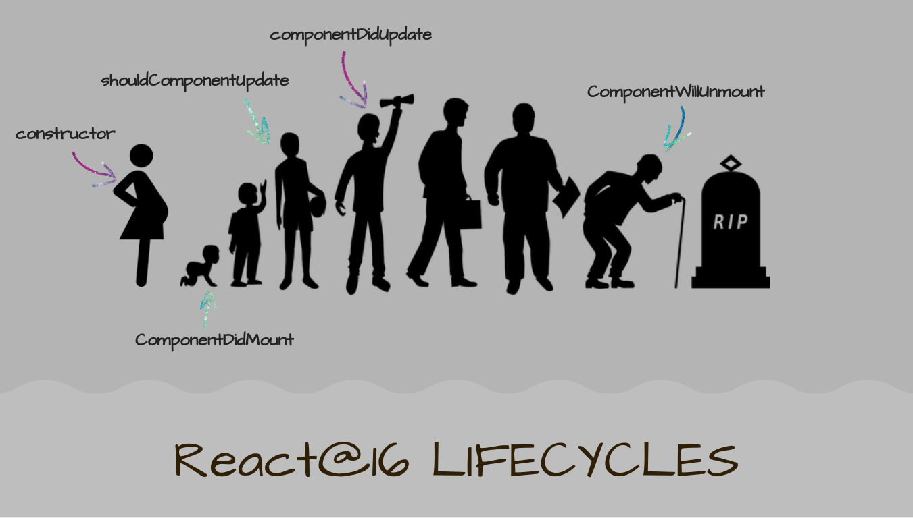

Pada awal mempelajari `React`, saya kesulitan dalam memahami konsep `life-cycle`. Begitu banyak `methods` yang harus difahami dus di hapal. Penamaannya _pun_ juga agak membingungkan, sebagian jarang digunakan dan pada saat awal-awal diperkenalkan hooks saya tambah bingung lagi. Disamping itu, beberapa `methods` ternyata akan tidak digunakan lagi di `React version 17` yang _mungkin_ awal tahun depan segera di release.

Di [`Official Documentation`](https://reactjs.org/docs/react-component.html) dijelaskan seluruh `methods` dengan lengkap berikut [Lifecycle Diagramnya](http://projects.wojtekmaj.pl/react-lifecycle-methods-diagram/). Namun harus sering di baca ulang dan melakukan eksperimen untuk mendapatkan pemahaman konsep agar lebih konkrit lagi. Tapi agaknya, otak saya yang agak-agak lemot. Untuk itulah tujuan utama menuliskan apa yang telah dan/atau tengah saya pelajari di blog ini.


## Analogi React Lifecycle

Kita hanya akan bahas garis besarnya saja, yakni:
  * Mounting - Birth
  * Updating - Growth
  * Unmounting - Death

<div className="Image__Medium">
  
</div>

> You can think of React lifecycle methods as the series of events that happen from the birth of a React component to its death. - Mosh Hamedani

Pada dokumentasi React dicontohkan tentang membuat component `Clock` menggunakan `class stateful component` seperti berikut:

```jsx {5,12,18,22,26}
import React, { Component } from 'react'
import ReactDOM from 'react-dom'

class Clock extends Component {
  constructor(props) {
    super(props)

    this.state = {
      date: new Date()
    }
  }
  componentDidMount() {
    this.timerID = setInterval(
      () => this.tick(),
      1000 // set the 2nd arg mount for each 1s
    )
  }
  componentWillUnmount() {
    clearInterval(this.timerID)
  }
  tick() {
    this.setState({
      date: new Date()
    })
  }
  render() {
    return (
      <div>
        <h1>Clock</h1>
        <FormattedDate
          date={this.state.date}
        />
      </div>
    )
  }
}

function FormattedDate(props) {
  return(
    <h2>
      Saat ini jam {' '}
      {props.date.toLocaleTimeString()}
    </h2>
  )
}

ReactDOM.render(
  <Clock />,
  document.getElementById('root'))
```

Karena fokus artikel ini adalah membahas `react lifecycle`, maka perhatikan `methods` yang di `highlight`!

* `constructor()` merupakan yang pertamakali dipanggil dalam `class component`.
* `render()` pada urutan kedua, yang merupakan `methods` yang wajib ada.
* `componentDidMount()` urutan selanjutnya pada contoh tersebut, paling umum digunakan untuk `fetch API`.
* `setState()` telah kita bahas untuk mengupdate initialState dengan konsep `immutibility`.
* `render()` dipanggil kembali setelah `setState()`
* `componentWillUnmount()` -- sederhananya -- berfungsi untuk menghapus puing-puing sisa `component` sehingga tidak terjadi `memory leak`.
* Pada contoh di atas `unmount` menggunakan `clearInterval()` karena pada proses `mounting` menggunakan `method setInterval()`


## Lifecycle menggunakan React Hooks

[Artikel sebelumnya](/before-and-after-hooks) kita menggunakan `useState` untuk menggantikan `initialState` dan `setState` pada `React Class Stateful Component`. Pada React Hooks, kita menggunakan `useEffect` untuk menggantikan `lifecycle methods` pada `React Class Component`.

```jsx {3,10-18}
import React, {
  useState,
  useEffect
} from 'react'
import ReactDOM from 'react-dom'

function Clock() {
  const [date, setDate] = useState(new Date())

  useEffect(() => {
    const timerID = setInterval(
      () => tick(),
      1000
    )
    return function cleanup() {
      return clearInterval(timerID)
    }
  })

  function tick() {
    return setDate(new Date())
  }

  return (
    <div>
      <h1>Clock using Hooks</h1>
      <FormattedDate date={date} />
    </div>
  )
}

// the rest code...
```

> "You can think of useEffect Hook as componentDidMount, componentDidUpdate, and componentWillUnmount combined." - React Official Documentation.

Terkadang kita memerlukan untuk `unmount component` dan terkadang tidak. Contoh di atas diperlukan, maka dituliskan `return function cleanup()`. Dinamakan `function cleanup()` hanyalah sebagai penjelas tujuannya semata. Kita dapat tulis dengan nama lain atau dengan `anonymous arrow function`.

```jsx {6}
// ...

  useEffect(() => {
    const timerID = setInterval(
      () => tick(), 1000)
    return () => clearInterval(timerID)
    }
  })

// ...
```

`React.useEffect()` merupakan pembahasan yang panjang dan _lumayan rumit_, seperti beberapa cara meng-`update component`.
Artikel ini hanya memberi pengenalan basic tentang `lifecycle` dalam `class component` dan `function component` menggunakan `React Hooks`.

Lebih lengkap sila baca [ Dokumentasi React ](https://reactjs.org) dan install [eslint-plugin-react-hooks](https://www.npmjs.com/package/eslint-plugin-react-hooks#installation) sebagai `guide` jika kita ragu apakah menuliskan `the 2nd argument`; `[]` atau `[someName]`.

---

### Latihan

```jsx live
// 🔴 React class component
const Wrapper = ({ children }) => (
  <div style={{
    background: 'papayawhip',
    width: '100%',
    padding: '2rem'
  }}>
    {children}
  </div>
)

class Counter extends React.Component {
  constructor() {
    super()
    this.state = { count: 0 }
  }

  componentDidMount() {
    this.interval = setInterval(() => {
      this.setState(state => ({ count: state.count + 1 }))
    }, 1000)
  }

  componentWillUnmount() {
    clearInterval(this.interval)
  }

  render() {
    return (
      <center style={{ fontSize: `64px` }}>
        <h1 style={{ color: `palevioletred` }}>
          {this.state.count}
        </h1>
      </center>
    )
  }
}

render(
  <Wrapper>
    <Counter />
  </Wrapper>
)
```

### Change the ☝️ code with 👇


```jsx
// 🔴 using hooks
const Wrapper = ({ children }) => (
  <div style={{
    background: 'papayawhip',
    width: '100%',
    padding: '2rem'
  }}>
    {children}
  </div>
)

function Counter() {
    const [count, setCount] = React.useState(0)

React.useEffect(() => {
  const interval = setInterval(() => {
    setCount(c => c + 1)
  }, 1000)
  return () => clearInterval(interval)
  }, [])

    return (
      <center style={{ fontSize: `64px` }}>
        <h1 style={{ color: `palevioletred` }}>
          {this.state.count} // ⌚ out!!
        </h1>
      </center>
    )
}

render(
  <Wrapper>
    <Counter />
  </Wrapper>
)
```